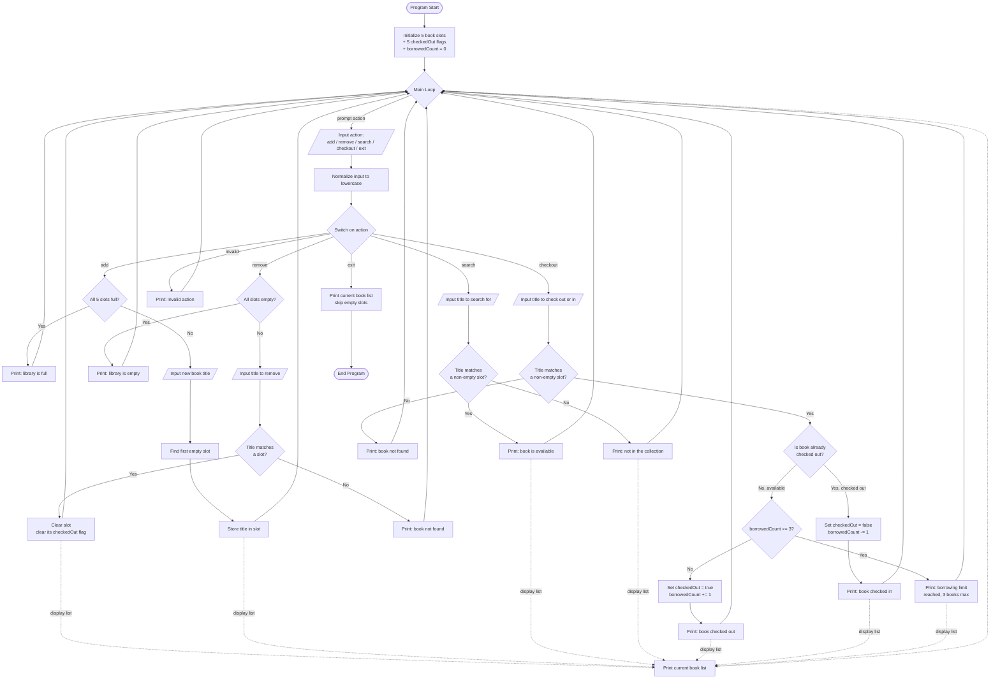

# Preliminary Flowchart — Library Management System (Course 2)

**Project:** `C2_Master-Assignment-Report .txt` — Final Project (Part 4 build on top of the Part 3 optimized base)
**Reference style:** `JD_Warehouse_v8__Flowchart.png` (Course 1 capstone flowchart conventions)
**Status:** Preliminary — drafted before code is written, to plan control flow ahead of implementation. Not yet verified against final code line numbers.

---

## Scope

This flowchart covers the three graded features from the Master Assignment Report (15 pts total), layered onto the existing Part 3 base (5 fixed-slot book variables, `add`/`remove`/`exit` loop):

| Feature | Points | Requirement |
|---|---|---|
| Search | 5 | Prompt for a title; report found/not found. |
| Borrowing Limit | 5 | Track books borrowed by the user; cap at 3. |
| Check-out Flag | 5 | Flag a book as checked out; allow check-in to clear the flag. |

Per the assignment, this build reuses the Part 3 optimized code (case-insensitive `action`, full/empty guard clauses, null-safe display) as its starting point, then adds two new menu actions (`search`, `checkout`) and a borrow-count tracker.

---

## Diagram

---

## Notes for implementation

- **Base carried forward from Part 3:** five fixed `string` slots (`book1`–`book5`), case-insensitive `action` comparison via `.ToLower()`, guard clauses before add/remove, null/empty-safe display loop. This flowchart does not re-derive that logic — see `C2_Master-Assignment-Report .txt`, Part 3, for the starting code.
- **New state needed:** a parallel boolean per slot (`book1CheckedOut`… `book5CheckedOut`, or a `bool[]` if refactored to arrays) and an `int borrowedCount`.
- **Open design question (flag on Program Start for Gate review):** should `checkout` be a single combined action (toggles based on current flag state, as drawn above), or two separate menu actions (`checkout` / `checkin`) matching the report's Step 3 wording more literally? The report's Step 3 instruction implies a single check-in path that inspects the existing flag, which is what's diagrammed here — confirm before building.
- **Borrowing limit scope:** the report doesn't specify whether the limit is global or per-book-slot; diagrammed here as a single global `borrowedCount`, incremented on checkout and decremented on check-in, capped at 3.
- **Not yet built:** this is a planning artifact only, per the project's Gate-based workflow (no code, `.cs` file, or repo changes in this step).

---

*Course 2 · Introduction to Programming With C# · Final Project (You Try It! Part 4 build) · Preliminary flowchart drafted before implementation, per Gate 3 of the standard workflow.*
